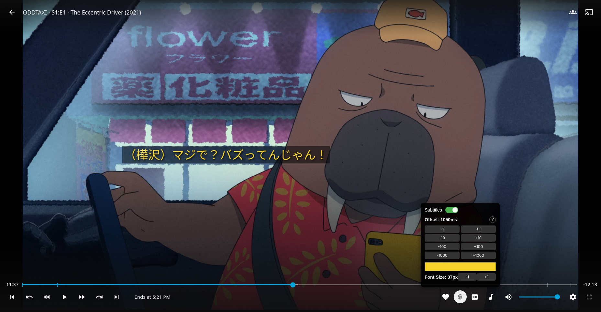

# Kuraji -「クラジ」 Automatic Japanese Subtitle Finder for Jellyfin

**Kuraji** is an open-source browser extension that automatically finds Japanese subtitles for the video you are watching. Currently focused on anime on Jellyfin, it searches, downloads, and overlays subtitles synchronized with your video.

## Motivation

Many streaming sites don’t provide Japanese subtitles for anime. Existing subtitle extensions often require you to source your own subtitles first, which can be tedious and time-consuming.

I created Kuraji to automatically find and load Japanese subtitles, saving time and effort while watching anime. Along the way, it also gave me a chance to improve my programming skills and explore web extension development.

## Features

* Movable, colorable, resizable subtitles.
* Automatically detects the title, season, and episode of your anime.
* Fetches subtitles from Japanese subtitle website.
* Matches the best subtitle using fuzzy search and episode metadata.
* Supports `.srt` subtitle files for immediate playback in Jellyfin.

## Supported Platforms

* **Browser:** Firefox (Chrome support planned)
* **Video Services:** Jellyfin (future plans: YouTube, Netflix, and other platforms using video tags; long-term goal: iframe video support)

## Future Plans

* Implement Chrome support.
* Expand compatibility to other video platforms beyond Jellyfin.
* Add support for multiple languages (requires sourcing additional subtitle databases).
* Support other subtitle file extensions (`.ass`).
* Implement archive subtitle extraction (.zip, .rar, etc.).

## How It Works

1. **Parse Video Title**
   Extracts title, season, episode, and year from the video filename.

2. **Fetch Metadata**
   Queries AniList for metadata, including alternative titles (romanized japanese titles, etc) and episode names.

3. **Generate Title Variants**
   Creates multiple search-friendly variants of the title to maximize matching chances.

4. **Fetch Subtitle Directory**
   Downloads HTML pages from Japanese subtitle repositories (currently Kitsunekko).

5. **Extract and Match Subtitle Files**

   * Parses `.srt` files from the HTML.
   * Tries exact season/episode match.
   * Fallback: episode title match using fuzzy search.
   * Last resort: first available subtitle.

6. **Download Subtitle**
   Fetches the matched subtitle file for overlaying on the video.

7. **Debounced and Cancel-Safe Handling**
   Prevents multiple simultaneous searches for the same video and allows canceling stale requests.

## Installation
If you want to build and run the extension yourself, you must:
1. Clone the repository:
   ```bash
   git clone https://github.com/ColeChiodo/subtitle-autoloader.git
   cd subtitle-autoloader/
   ```

2. Install and build the Extension
    ```bash
    npm install
    npm run build
    ```
3. Load the extension in Firefox:
   * Go to `about:debugging`
   * Click **Load Temporary Add-on**
   * Select the `manifest.json` in the built `dist` directory
4. Start watching anime on Jellyfin and enjoy auto-loaded Japanese subtitles.


## Development
* Written in TypeScript with full React + Vite support
* Uses fast-fuzzy for subtitle file matching
* Parses, fetches metadata, searches, and downloads subtitles in a modular architecture
* Styled with TailwindCSS; linted with ESLint for consistent code quality
* Cross-browser compatible via webextension-polyfill

## Example Screenshots


## License

MIT License © 2025 colechiodo.cc
