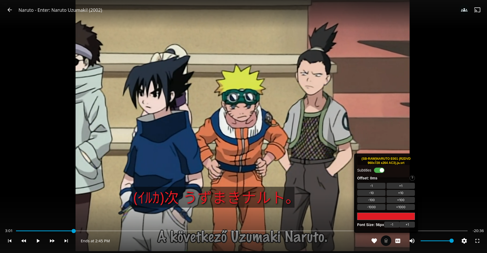
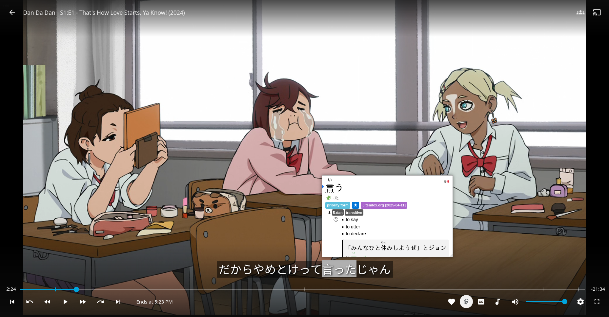

# Kuraji -「クラジ」 Automatic Japanese Subtitle Finder for Jellyfin

**Kuraji** is an open-source browser extension for Firefox and Chrome that automatically finds Japanese subtitles for the video you are watching. Currently focused on anime on Jellyfin, it searches, downloads, and overlays subtitles synchronized with your video.

## How to use
To use the extension. You must do the following:
1. **Generate and Save a GitHub Token**
   * [**Create a fine-grained personal access token on GitHub**](https://docs.github.com/en/authentication/keeping-your-account-and-data-secure/managing-your-personal-access-tokens#creating-a-fine-grained-personal-access-token)
      * Ensure Public repository access
   * **Open Kuraji settings page**
   * **Paste** generated token into text field, and click **"Save Token"**
      * This should be done because GitHub API rate limits unauthorized requests to 60/hr. Authorized increases that to 1000/hr.
      * One single anime episode lookup *could* use 20+ requests.
2. **Open your favorite video streaming site**
3. **(Optional)** Pair with a Japanese Popup Dictionary like [Yomitan](https://yomitan.wiki/) to assist in your language learning.

## Motivation

Many streaming sites don’t provide Japanese subtitles for anime. Existing subtitle extensions often require you to source your own subtitles first, which can be tedious and time-consuming.

I created Kuraji to automatically find and load Japanese subtitles, saving time and effort while watching anime. Along the way, it also gave me a chance to improve my programming skills and explore web extension development.

## Features

* Movable, colorable, resizable subtitles.
* Automatically detects the title, season, and episode of your anime.
* Fetches subtitles from Japanese subtitle repository.
* Matches the best subtitle using fuzzy search and episode metadata.
* Supports `.srt` subtitle files for immediate playback in Jellyfin.

## Supported Platforms

* **Browser:** Firefox and Chrome
* **Video Services:** Jellyfin

## Future Plans
What I want to implement to this extension in the future. In order of most realistic:
* Expand compatibility to other video platforms beyond Jellyfin (Youtube, Netflix, maybe more).
* Support other subtitle file extensions (`.ass`).
* Add Japanese language support for live action tv shows/movies/dramas (requires sourcing of additional subtitle databases).
* Support Video Streaming sites that use iFrame for video embeds (will require creating custom system for syncing to video).

## How It Works

1. **Parse Video Title**

   Extracts title, season, episode, and year from the video filename.

2. **Fetch Metadata**
   
   Queries [AniList](https://docs.anilist.co/) and [Jikan (Unofficial MyAnimeList API)](https://jikan.moe/) for metadata, including alternative titles (romanized japanese titles, etc) and episode names.

3. **Generate Title Variants**
   
   Creates multiple search-friendly variants of the title to maximize matching chances.

4. **Fetch Subtitle Directory**
   
   Sources from Japanese subtitle repositories using GitHub API (currently [Ajatt-Tools Kitsunekko Mirror](https://github.com/Ajatt-Tools/kitsunekko-mirror)).

5. **Extract and Match Subtitle Files**

   * Parses `.srt` files from repo.
   * Tries exact season/episode match.
   * Fallback: episode title match using fuzzy search.
   * Last resort: first available subtitle.

6. **Download Subtitle**
   
   Fetches the matched subtitle file for overlaying on the video.

## Installation
If you want to build and run the extension yourself, you must:
1. Clone the repository:
   ```bash
   git clone https://github.com/ColeChiodo/subtitle-autoloader.git
   cd subtitle-autoloader/
   ```

2. Install and build the Extension
    ```bash
    npm install
    ```
    Build for your target browser:
    ```bash
    npm run build:firefox
    ``` 
    ```bash
    npm run build:chrome
    ```
3. Load the extension 

   **Firefox:**
   * Go to `about:debugging`
   * Click **Load Temporary Add-on**
   * Select the `manifest.json` in the built `dist` directory

   **Chrome**
   * Go to `chrome://extensions/`
   * Toggle **Developer mode** in the top right.
   * Click **“Load unpacked”**.
      * Select the built `dist` directory.

4. Start watching anime on Jellyfin and enjoy auto-loaded Japanese subtitles.


## Development
* Written in TypeScript with full React + Vite support
* Uses fast-fuzzy for subtitle file matching
* Parses, fetches metadata, searches, and downloads subtitles in a modular architecture
* Styled with TailwindCSS; linted with ESLint for consistent code quality
* Cross-browser compatible via webextension-polyfill

## Example Screenshots




## License

MIT License © 2025 colechiodo.cc
