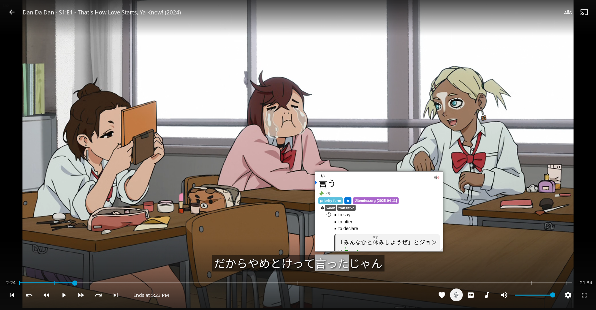
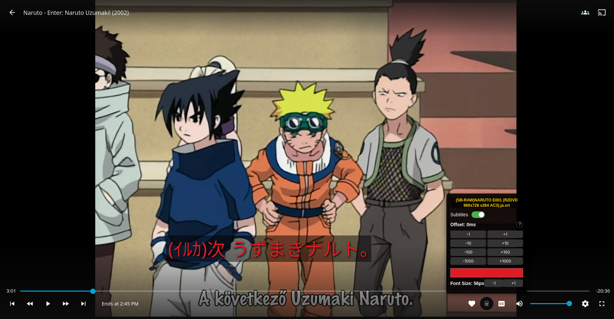

# Kuraji -「クラジ」 Automatic Japanese Subtitle Finder

**Kuraji** is an open-source browser extension for Firefox and Chrome that automatically finds Japanese subtitles for the video you are watching. Currently focused on anime on Jellyfin, Plex, Youtube, and more. It searches, downloads, and overlays subtitles synchronized with your video.

[](https://addons.mozilla.org/firefox/addon/kuraji)
[](https://chromewebstore.google.com/detail/gbeolmhljhgoidkalfbkagobfhpgkfbf)


## How to use
### To use the extension. You must do the following:
1. **(Optional/Recommended) Generate and Save a GitHub Token**
   * [**Create a fine-grained personal access token on GitHub**](https://docs.github.com/en/authentication/keeping-your-account-and-data-secure/managing-your-personal-access-tokens#creating-a-fine-grained-personal-access-token)
      * Ensure Public repository access
   * **Open Kuraji settings page**
   * **Paste** generated token into text field, and click **"Save Token"**
      * This should be done because GitHub API rate limits unauthorized requests to 60/hr. Authorized increases that to 1000/hr.
      * One single anime episode lookup *could* use 20+ requests.
2. **Open your favorite video streaming site**
3. **(Optional)** Pair with a Japanese Popup Dictionary like [Yomitan](https://yomitan.wiki/) to assist in your language learning.
   * Which can also be used for [Anki](https://apps.ankiweb.net/) flashcard support



## Motivation

Many streaming sites don’t provide Japanese subtitles for anime. Existing subtitle extensions often require you to source your own subtitles first, which can be tedious and time-consuming.

I created Kuraji to automatically find and load Japanese subtitles, saving time and effort while watching anime. Along the way, it also gave me a chance to improve my programming skills and explore web extension development.

## Features

* Movable, colorable, resizable subtitles.
* Automatically detects the title, season, and episode of your anime.
* Fetches subtitles from Japanese subtitle repository.
* Matches the best subtitle using fuzzy search and episode metadata.
* Supports `.srt` and `.ass` subtitle files for immediate playback.
* Category selection (TV Anime, Movie Anime, TV Drama, Movie Drama).
* Interactive folder and file selection with auto-selection of best match.
* Folder caching (3 hours) for faster repeated searches.

## Recent Changes (v0.4.0)

### New Features
- **Category Selection**: Dropdown to select between TV Anime, Movie Anime, TV Drama, Movie Drama, or All Categories. This fixes the issue where searching for movies would incorrectly match TV episodes.
- **Interactive Selection**: Anime and file dropdowns with auto-selection of best match. User can change selection if needed.
- **ASS Support**: Added basic support for `.ass` subtitle files (Advanced Substation Alpha).
- **Folder Caching**: Folder lists are cached for 3 hours to reduce API calls and improve search speed.
- **Clear Cache Button**: Added button in settings to manually clear the folder cache.

### How the New Search Works
1. Enter anime title and optionally select a category (e.g., "Movie Anime")
2. Click Search - folders are fetched from GitHub
3. Best matching anime folder is auto-selected (user can change via dropdown)
4. Files in the folder are loaded - select a subtitle file
5. Subtitles load automatically upon file selection

### Settings Page Updates
- Added "Clear Folder Cache" button to force refresh folder listings
- Cache automatically expires every 3 hours (matches GitHub repo update cycle)

## Supported Platforms

* **Browser:** Firefox and Chrome Based
* **Video Services:** Jellyfin, Youtube, Plex
   * **Basic iFrame Support**

## Future Plans
### What I want to implement to this extension in the future:
* Expand website compatibility
* Fix iFrame site quirks (fullscreen, etc)

### Site Support Wishlist
* Netflix
* Crunchyroll
* Miruro

Request more by [submitting an issue](https://github.com/ColeChiodo/subtitle-autoloader/issues). (No guarantee that I will add support)

## How It Works

1. **Parse Video Title**

   Extracts title, season, episode, and year from the video filename.

2. **Fetch Metadata**
   
   Queries [AniList](https://docs.anilist.co/) and [Jikan (Unofficial MyAnimeList API)](https://jikan.moe/) for metadata, including alternative titles (romanized japanese titles, etc) and episode names.

3. **Generate Title Variants**
   
   Creates multiple search-friendly variants of the title to maximize matching chances.

4. **Fetch Subtitle Directory**
   
   Sources from Japanese subtitle repositories using GitHub API (currently [Ajatt-Tools Kitsunekko Mirror](https://github.com/Ajatt-Tools/kitsunekko-mirror)).

5. **Extract and Match Subtitle Files**

   * Parses `.srt` files from repo.
   * Tries exact season/episode match.
   * Fallback: episode title match using fuzzy search.
   * Last resort: first available subtitle.

6. **Download Subtitle**
   
   Fetches the matched subtitle file for overlaying on the video.

## Installation

You can either **use the prebuilt extension ZIPs** or **build it yourself from source**.

### Option 1: Using the Prebuilt ZIP (easiest)

1. **Download the ZIP** for your browser from the [Releases page](https://github.com/ColeChiodo/subtitle-autoloader/releases).
2. **Extract** the ZIP file to a convenient location.
3. **Load the extension:**

   * **Firefox:**

     * Go to `about:debugging`
     * Click **“Load Temporary Add-on”**
     * Select the `manifest.json` file inside the extracted folder
   * **Chrome:**

     * Go to `chrome://extensions/`
     * Enable **Developer mode** (top right)
     * Click **“Load unpacked”**
     * Select the extracted folder
4. **Start watching anime** — your Japanese subtitles will load automatically!

### Option 2: Building from Source

1. **Clone the repository:**

   ```bash
   git clone https://github.com/ColeChiodo/subtitle-autoloader.git
   cd subtitle-autoloader/
   ```
2. **Install dependencies and build for your browser:**

   ```bash
   npm install
   ```
   Build for your target browser:
   ```bash
   npm run build:firefox
   ```
   ```bash
   npm run build:chrome
   ```
3. **Load the extension:**

   * **Firefox:**
      * Go to `about:debugging`
      * **Load Temporary Add-on** 
      * Select `manifest.json` in the `dist` folder.
   * **Chrome:**
      * Go to `chrome://extensions/` 
      * Enable **Developer mode** 
      * **Load unpacked** 
      * Select the `dist` folder.

4. **Start watching anime** — your Japanese subtitles will load automatically!


## Development
* Written in TypeScript with full React + Vite support
* Uses fast-fuzzy for subtitle file matching
* Parses, fetches metadata, searches, and downloads subtitles in a modular architecture
* Styled with TailwindCSS; linted with ESLint for consistent code quality
* Cross-browser compatible via webextension-polyfill



[](https://addons.mozilla.org/firefox/addon/kuraji)
[](https://chromewebstore.google.com/detail/gbeolmhljhgoidkalfbkagobfhpgkfbf)

**© 2025 [colechiodo.cc](https://colechiodo.cc) | MIT License**
